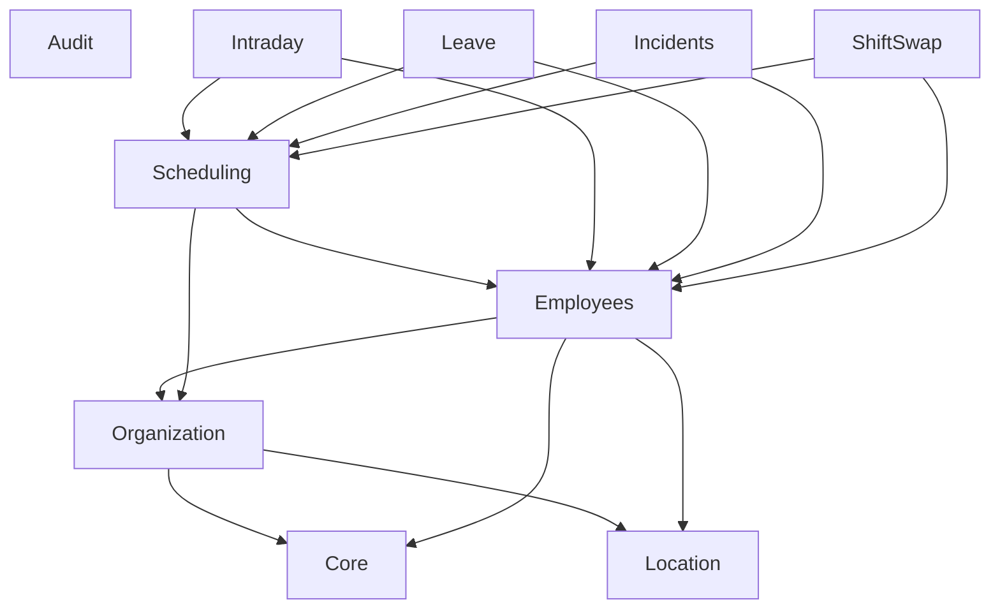

# Arquitectura de Módulos → Modelos

## 1️⃣ **Core / Identity Module**

Responsable de **usuarios del sistema, autenticación y permisos**.

### Models

```
app/Modules/Core/Models/
```

* `User`
* `Role`
* `Permission`

### Tablas

```
users
roles
permissions
role_has_permissions
model_has_roles
model_has_permissions
```

### Responsabilidades

* Autenticación
* Autorización
* Gestión de cuentas

### Events sugeridos

```
UserRegistered
UserActivated
UserDeactivated
PasswordChanged
```

---

# 2️⃣ **Employees Module**

Representa **la entidad laboral del empleado**, separada del usuario.

### Models

```
app/Modules/Employees/Models/
```

* `Employee`
* `EmploymentStatus`
* `EmployeePosition`
* `EmployeeDependent`
* `EmployeeDisease`
* `EmployeeDisability`

### Tablas

```
employees
employment_statuses
employee_positions
employee_dependents
employee_diseases
employee_disabilities
```

### Relaciones importantes

```
Employee
 ├── belongsTo User
 ├── belongsTo Department
 ├── belongsTo Position
 ├── belongsTo Township
 ├── belongsTo EmploymentStatus
 └── belongsTo Employee (parent_id)
```

### Events sugeridos

```
EmployeeHired
EmployeePromoted
EmployeeTransferred
EmployeeTerminated
```

---

# 3️⃣ **Organization Module**

Define la **estructura organizacional**.

### Models

```
app/Modules/Organization/Models/
```

* `Directorate`
* `Department`
* `Position`
* `Team`
* `TeamMember`

### Tablas

```
directorates
departments
positions
teams
team_members
```

### Relaciones

```
Directorate
 └── hasMany Departments

Department
 └── hasMany Positions

Team
 └── hasMany TeamMembers
```

---

# 4️⃣ **Location Module**

Catálogos geográficos.

### Models

```
app/Modules/Location/Models/
```

* `Province`
* `District`
* `Township`

### Tablas

```
provinces
districts
townships
```

### Relaciones

```
Province
 └── hasMany Districts

District
 └── hasMany Townships
```

---

# 5️⃣ **Scheduling Module (WFM Core)**

Este es el **núcleo del sistema**.

### Models

```
app/Modules/Scheduling/Models/
```

* `Schedule`
* `WeeklySchedule`
* `WeeklyScheduleAssignment`
* `BreakTemplate`
* `EmployeeBreakOverride`

### Tablas

```
schedules
weekly_schedules
weekly_schedule_assignments
break_templates
employee_break_overrides
```

### Relaciones

```
WeeklySchedule
 └── hasMany WeeklyScheduleAssignments

WeeklyScheduleAssignment
 ├── belongsTo WeeklySchedule
 ├── belongsTo Employee
 └── belongsTo Schedule
```

---

# 6️⃣ **Intraday Module**

Gestión de **actividades dentro del turno**.

### Models

```
app/Modules/Intraday/Models/
```

* `IntradayActivity`
* `IntradayActivityAssignment`

### Tablas

```
intraday_activities
intraday_activity_assignments
```

---

# 7️⃣ **Leave Management Module**

Permisos laborales.

### Models

```
app/Modules/Leave/Models/
```

* `LeaveRequest`
* `LeaveRequestApproval`

### Tablas

```
leave_requests
leave_request_approvals
```

### Estados

```
pending
approved
rejected
cancelled
```

### Events

```
LeaveRequested
LeaveApproved
LeaveRejected
LeaveCancelled
```

---

# 8️⃣ **Incidents Module**

Incidencias operativas.

### Models

```
app/Modules/Incidents/Models/
```

* `IncidentType`
* `AttendanceIncident`

### Tablas

```
incident_types
attendance_incidents
```

---

# 9️⃣ **Shift Swap Module**

Cambios de turno entre empleados.

### Models

```
app/Modules/ShiftSwap/Models/
```

* `ShiftSwapRequest`
* `ShiftSwapApproval`

### Tablas

```
shift_swap_requests
shift_swap_approvals
```

### Events

```
ShiftSwapRequested
ShiftSwapApproved
ShiftSwapRejected
```

---

# 🔟 **Audit Module**

Auditoría del sistema.

### Models

```
app/Modules/Audit/Models/
```

* `AuditLog`

### Tabla

```
audit_logs
```

---

# Mapa completo Módulos → Modelos

```
Core
 ├── User
 ├── Role
 └── Permission

Employees
 ├── Employee
 ├── EmployeePosition
 ├── EmployeeDependent
 ├── EmployeeDisease
 └── EmployeeDisability

Organization
 ├── Directorate
 ├── Department
 ├── Position
 └── Team

Location
 ├── Province
 ├── District
 └── Township

Scheduling
 ├── Schedule
 ├── WeeklySchedule
 ├── WeeklyScheduleAssignment
 ├── BreakTemplate
 └── EmployeeBreakOverride

Intraday
 ├── IntradayActivity
 └── IntradayActivityAssignment

Leave
 ├── LeaveRequest
 └── LeaveRequestApproval

Incidents
 ├── IncidentType
 └── AttendanceIncident

ShiftSwap
 ├── ShiftSwapRequest
 └── ShiftSwapApproval

Audit
 └── AuditLog
```

---

# ⚠️ Riesgos arquitectónicos

### 1️⃣ El módulo `Employees` puede volverse gigante

Es común en ERP.

Solución futura:

```
Employees
HR
Payroll
```

---

### 2️⃣ Scheduling será el módulo más complejo

Porque conecta:

```
Employees
Intraday
Leave
Incidents
ShiftSwap
```

Recomendado usar **Events para desacoplar**.

---

### 3️⃣ Evitar dependencias directas

Ejemplo incorrecto:

```php
use App\Modules\Employees\Models\Employee;
```

Dentro de `Scheduling`.

Preferir:

```
EmployeeAssignedToSchedule event
```

---

# Recomendación crítica para este proyecto

Agregar un módulo adicional:

```
WorkforcePlanning
```

para:

```
forecast
staffing
capacity planning
```
===

Un **diagrama de dependencias entre módulos** es uno de los artefactos más importantes en un **Monolito Modular**, porque define **qué módulos pueden conocer a cuáles** y **cómo se comunican**.

Esto evita el problema clásico:

```
Orders → Users → Notifications → Orders
```

que termina generando **dependencias circulares**.

Voy a proponerte una **arquitectura en capas de módulos** adecuada para tu **sistema WFM**.

---

# Diagrama de Dependencias entre Módulos

### Principio arquitectónico

```
Los módulos solo pueden depender de módulos en capas inferiores.
Nunca al revés.
```

---

# Capas del Monolito

## 1️⃣ Foundation Layer (Base del sistema)

Son módulos **transversales**.
Todos pueden depender de ellos.

**Módulos:**

```
Core
Location
Audit
```

Responsabilidades:

```
Core       → usuarios, roles, permisos
Location   → provincias, distritos, corregimientos
Audit      → logs de auditoría
```

---

## 2️⃣ Organization Layer

Define la **estructura institucional**.

**Módulo:**

```
Organization
```

Responsabilidad:

```
directorates
departments
positions
teams
```

Dependencias permitidas:

```
Organization → Core
Organization → Location
```

---

## 3️⃣ Workforce Layer

Representa **personas y su estado laboral**.

**Módulo:**

```
Employees
```

Responsabilidad:

```
empleados
estado laboral
jerarquía organizacional
```

Dependencias:

```
Employees → Organization
Employees → Core
Employees → Location
```

---

## 4️⃣ Workforce Operations Layer

Aquí vive la **lógica operativa del call center**.

Módulos:

```
Scheduling
Intraday
Leave
Incidents
ShiftSwap
```

---

### Scheduling (núcleo WFM)

Responsabilidad:

```
plantillas de horario
programación semanal
asignación de turnos
```

Dependencias:

```
Scheduling → Employees
Scheduling → Organization
```

---

### Intraday

Responsabilidad:

```
actividades dentro del turno
gestión de breaks
```

Dependencias:

```
Intraday → Scheduling
Intraday → Employees
```

---

### Leave

Responsabilidad:

```
permisos laborales
vacaciones
ausencias
```

Dependencias:

```
Leave → Employees
Leave → Scheduling
```

---

### Incidents

Responsabilidad:

```
incidencias operativas
tardanzas
ausencias
```

Dependencias:

```
Incidents → Employees
Incidents → Scheduling
```

---

### ShiftSwap

Responsabilidad:

```
cambios de turno entre empleados
```

Dependencias:

```
ShiftSwap → Scheduling
ShiftSwap → Employees
```

---

# Diagrama completo (Mermaid)

Este diagrama lo puedes poner directamente en tu documentación.



---

# Visualización por capas

```
┌────────────────────────────┐
│        FOUNDATION          │
│  Core | Location | Audit   │
└─────────────┬──────────────┘
              │
┌─────────────▼──────────────┐
│       ORGANIZATION         │
│        Organization        │
└─────────────┬──────────────┘
              │
┌─────────────▼──────────────┐
│         WORKFORCE          │
│          Employees         │
└─────────────┬──────────────┘
              │
┌─────────────▼────────────────────────────┐
│         WORKFORCE OPERATIONS             │
│ Scheduling | Intraday | Leave | Incidents│
│ ShiftSwap                               │
└─────────────────────────────────────────┘
```

---

# Regla clave para el código

En tus módulos **solo deberías importar modelos de módulos inferiores**.

Ejemplo válido:

```php
use App\Modules\Employees\Models\Employee;
```

dentro de `Scheduling`.

---

Ejemplo **prohibido**:

```php
use App\Modules\Scheduling\Models\WeeklySchedule;
```

dentro de `Employees`.

Eso rompe la dirección de dependencias.

---

# Comunicación recomendada entre módulos

Cuando la dependencia sería inversa, usar **Events**.

Ejemplo:

```
LeaveApproved
```

Evento emitido por:

```
Leave Module
```

Escuchado por:

```
Scheduling Module
```

para recalcular disponibilidad.

---

# Ejemplo real en tu sistema

Flujo:

```
LeaveRequestApproved
        │
        ▼
SchedulingListener
        │
        ▼
RecalculateScheduleAction
```

Esto evita:

```
Scheduling → Leave
```

---

# Riesgo importante en este tipo de arquitectura

El módulo **Scheduling** se convierte en el **centro del sistema**.

Conecta con:

```
Employees
Intraday
Leave
Incidents
ShiftSwap
```

Por eso debes tratarlo como **bounded context principal**.

---

# Mejora arquitectónica que recomiendo

Agregar un módulo:

```
WorkforcePlanning
```

Responsabilidad:

```
forecast
capacity planning
staffing requirements
```

Dependencias:

```
WorkforcePlanning → Employees
WorkforcePlanning → Scheduling
```

---
